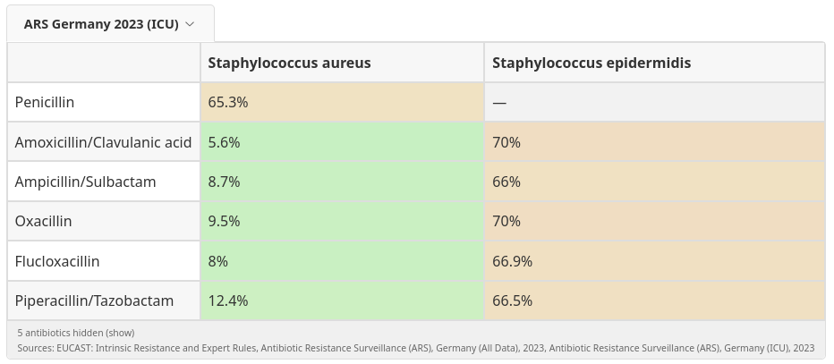

# Docusaurus Resistogram Plugin


[](https://opensource.org/licenses/MIT)

A Docusaurus v3 plugin to display resistance data tables (resistograms) from CSV files using a simple directive in your Markdown files.

This plugin is designed for medical, veterinary, or scientific documentation sites. It allows content editors without programming knowledge to embed complex data visualizations into their content. The plugin handles data processing and rendering, providing an interactive table to the reader.

## Motivation

The core challenge in clinical practice is the recommendation to base antibiotic therapy on the local resistance situation. However, this data is often difficult to access and requires significant expertise to interpret.

This plugin aims to solve that problem by:
- **Making Data Accessible:** It directly integrates resistance statistics into the clinical workflow, making them available to clinicians at the point of care.
- **Leveraging Modern Documentation:** Docusaurus serves as a modern, user-friendly platform. It builds a static HTML website that can be easily hosted on any web server. Furthermore, it can be configured to work as a Progressive Web App (PWA), making the information available offline and on any device. This is a powerful feature for delivering critical information to users, regardless of their location or network conditions.
- **Empowering Non-Technical Editors:** The content and data can be maintained by medical staff without requiring deep knowledge of computer science or data science.

Ultimately, the goal is to bridge the gap between raw data and clinical decision-making.



## Features

- **Simple Content Integration:** Editors use a `%%RESIST%%` directive in their MDX files to insert a table.
- **Content-based Data Selection (`auto` mode):** Scans the page's text to find synonyms for organisms and antibiotics, then automatically displays the relevant data. It excludes code blocks from the scan.
- **Hierarchical Data Sources:** Define relationships between datasets. Data from a child source (e.g., national data) can override data from a parent source (e.g., global EUCAST data).
- **Automatic Taxonomic Sorting:** Organisms are automatically sorted based on the hierarchy defined in `organism_classes.csv`, ensuring a logical and consistent presentation. Antibiotics are also sorted according to their class definitions.
- **Adaptive Table Layout:** The table automatically adjusts its display mode (`full`, `compact`, `superCompact`) based on the available container width. In compact modes, it uses the abbreviated names defined in your data files to save space.
- **Interactive UI:**
    - **Tooltips:** Provides details on hover for cells and headers.
    - **Highlighting:** Highlights corresponding rows and columns on hover.
    - **Legend:** Displays a legend for abbreviated headers in compact modes.
    - **Data Source Switcher:** A dropdown menu allows users to select from the configured data sources.
- **Multi-Language Support (i18n):** The UI text is translatable. It ships with support for German, English, French, Spanish, and Italian, with English as a fallback.
- **Build-Time Data Processing:** CSV data is processed and cached during the Docusaurus build, ensuring fast page loads.

## Installation

```bash
npm install Uli-Z/docusaurus-plugin-resistogram
```

## Setup

1.  **Create a data directory** in your Docusaurus project root (e.g., `data`).
2.  **Add your data files** to this directory. See the [Data File Structure](#data-file-structure) section for details.
    - `data_sources.csv` (required)
    - `antibiotics.csv` (required)
    - `organisms.csv` (required)
    - `resistance.csv` (or other files, as defined in `data_sources.csv`)
    - `antibiotic_classes.csv` (optional)
    - `organism_classes.csv` (optional)

3.  **Configure the plugin** in your `docusaurus.config.ts`. This is a two-step process: you must register the main plugin and then register the content transformation plugin (Remark) for the content type where you want to use it (e.g., `docs`).

    ```typescript
    // docusaurus.config.ts
    import type {Config} from '@docusaurus/types';
    import type * as Preset from '@docusaurus/preset-classic';
    // 1. Import the remark plugin
    import remarkResistogram from 'docusaurus-plugin-resistogram/remark';

    const config: Config = {
      // ...

      // 2. Configure the main plugin
      // This plugin handles data processing.
      plugins: [
        [
          'docusaurus-plugin-resistogram',
          {
            // A unique ID for this plugin instance.
            id: 'example-resistogram',
            dataDir: 'data', // Path to your data directory
          },
        ],
        // You can add more instances with different IDs and data directories.
      ],

      // 3. Configure the remark plugin within your preset
      // This plugin finds and replaces the %%RESIST%% directives.
      presets: [
        [
          'classic',
          {
            docs: {
              sidebarPath: './sidebars.ts',
              remarkPlugins: [
                // Link it to the main plugin using the same ID.
                [remarkResistogram, { pluginId: 'example-resistogram' }]
              ],
            },
            // You can also add it to `blog` or `pages`.
          } satisfies Preset.Options,
        ],
      ],
    };

    export default config;
    ```
    **Important:** The `id` in the `plugins` section must match the `pluginId` in the `remarkPlugins` section. This links the content transformer to its corresponding dataset.

## Usage

### For Content Editors

To display a resistogram, add a `%%RESIST%%` block into an MDX file. You can control what the table shows using parameters inside the block.

- `abx=auto`: Automatically selects antibiotics based on the page content.
- `org=all`: Shows all available organisms.
- `org="E. coli",B_STPHY_AURS`: Shows only *E. coli* and *Staphylococcus aureus*.
- `source=ARS`: Initially displays data from the 'ARS' source.

### Directive Parameters

The `%%RESIST%%` directive accepts the following space-separated parameters. Values with spaces must be enclosed in double quotes.

| Parameter | Description                                                                     | Values                                                                                                                            |
| :-------- | :------------------------------------------------------------------------------ | :-------------------------------------------------------------------------------------------------------------------------------- |
| `abx`     | Specifies the antibiotics to display.                                           | `auto` (default), `all`, or a comma-separated list of IDs/synonyms (e.g., `PEN,"Beta-lactam"`).                                   |
| `org`     | Specifies the organisms to display.                                             | `auto` (default), `all`, or a comma-separated list of IDs/synonyms (e.g., `B_ESCHR_COLI,"gram-positive bacteria"`).              |
| `source`  | Selects the initial data source by its ID or a synonym from `data_sources.csv`. | An ID or synonym (e.g., `eucast-expected`, `ARS DE 2023`). If not set, the first source sorted by year is used as a fallback. |

### Examples

```mdx
<!-- Auto-detect everything from the page content -->
%%RESIST%%

<!-- Show resistance for Penicillin and all Cephalosporins against all organisms -->
%%RESIST abx=PEN,Cephalosporins org=all%%

<!-- Automatically detect organisms, but only show data for Ciprofloxacin -->
%%RESIST abx=CIP org=auto%%

<!-- Show data for all gram-positive bacteria from a specific data source -->
%%RESIST abx=all org="gram-positive bacteria" source="ARS DE 2023"%%
```

## Data File Structure

The plugin is powered by a set of CSV files.

### `data_sources.csv`

This file defines the different datasets and their relationships.

| id             | parent_id      | name_de                         | year | source_file                     | ... |
| :------------- | :------------- | :------------------------------ | :--- | :------------------------------ | :-- |
| `eucast-base`  |                | EUCAST Regeln                   |      | `eucast_rules.csv`              |     |
| `ars-de-2023`  | `eucast-base`  | ARS Deutschland 2023            | 2023 | `resistance_ars_2023.csv`       |     |

- `id`: A unique identifier for the data source.
- `parent_id`: (Optional) The `id` of another source to inherit data from. Data in the child source will override parent data.
- `name_*`: The display name for the source in the UI, localized by language (e.g., `name_de`, `name_en`).
- `year`: The year of the data, used for sorting.
- `source_file`: The CSV file containing the resistance data for this source.
- `source_long_name_*`, `source_short_name_*`, `source_url`: (Optional) Additional metadata for display.

### `antibiotics.csv` & `organisms.csv`

These files define the items that appear in the table's rows and columns.

| id             | short_name | full_name           | synonyms                     |
| :------------- | :--------- | :------------------ | :--------------------------- |
| `B_ESCHR_COLI` | E. coli    | *Escherichia coli*  | E. coli,Escherichia coli     |

- `id`: A unique identifier (required).
- `short_name`: A short name for compact table views (required).
- `full_name`: The full name for display and tooltips (required).
- `synonyms`: A comma-separated list of terms for the `auto` mode (required).

### Resistance Data File (e.g., `resistance.csv`)

This file contains the resistance values. The filename must be listed in `data_sources.csv`.

| antibiotic_id | organism_id    | n_isolates | resistance_pct |
| :------------ | :------------- | :--------- | :------------- |
| `PEN`         | `B_ESCHR_COLI` | 123        | 85             |

- `antibiotic_id`: Must match an `id` in `antibiotics.csv`.
- `organism_id`: Must match an `id` in `organisms.csv`.
- `n_isolates`: The number of isolates tested.
- `resistance_pct`: The percentage of resistant isolates.

### `*_classes.csv` (Optional)

These files allow you to group antibiotics and organisms. The `organism_classes.csv` file supports a `parent_id` column to create a taxonomic hierarchy, which is used for sorting the table rows.

| id                  | parent_id  | name_en                 | synonyms_en        |
| :------------------ | :--------- | :---------------------- | :----------------- |
| `bacteria`          |            | Bacteria                |                    |
| `firmicutes`        | `bacteria` | Gram-positive bacteria  | Gram-positive      |

## Internationalization (i18n)

UI text is stored in `src/theme/ResistanceTable/i18n.ts`. You can edit this file to add support for new languages or change existing translations. The plugin uses the current Docusaurus locale and falls back to English if a translation is missing.

## License

This project is licensed under the MIT License.
